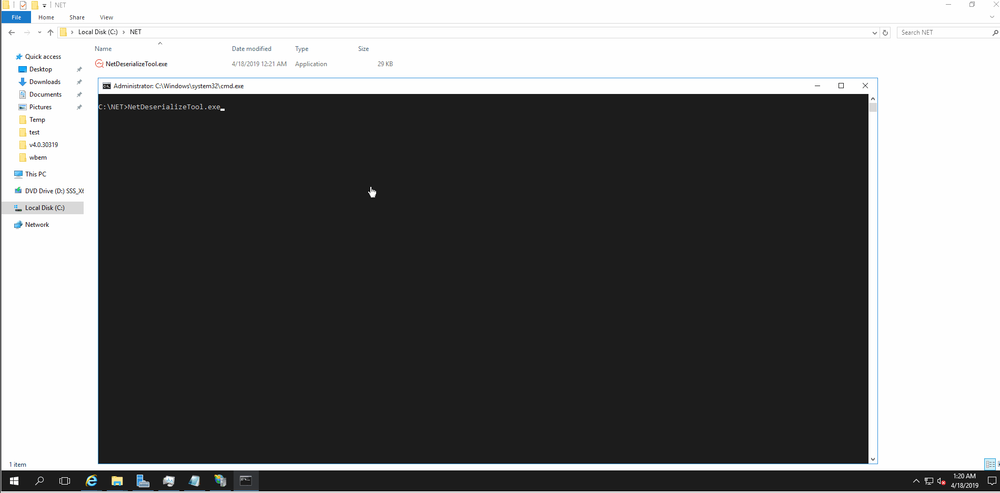

# NetDeserializeTool
.net反序列化课程中提到的漏洞检测工具 ，目前支持四种反序列化漏洞检测（jsonnet , fastjson , javascriptserializer , netdatacontractserializer ,objectstateformatter , losformatter）


## 以学习研究、安全业务的需求为目的，杜绝一切非法操作。


## 使用方法

```

提供了一个自动检测所以的漏洞类型all，
Example:cmd.exe /c NetDeserializeTool.exe all http://www.target.com/Default.aspx Parameter Payload

```





# 本次更新了 objectstateformatter , losformatter 类型的漏洞检测

